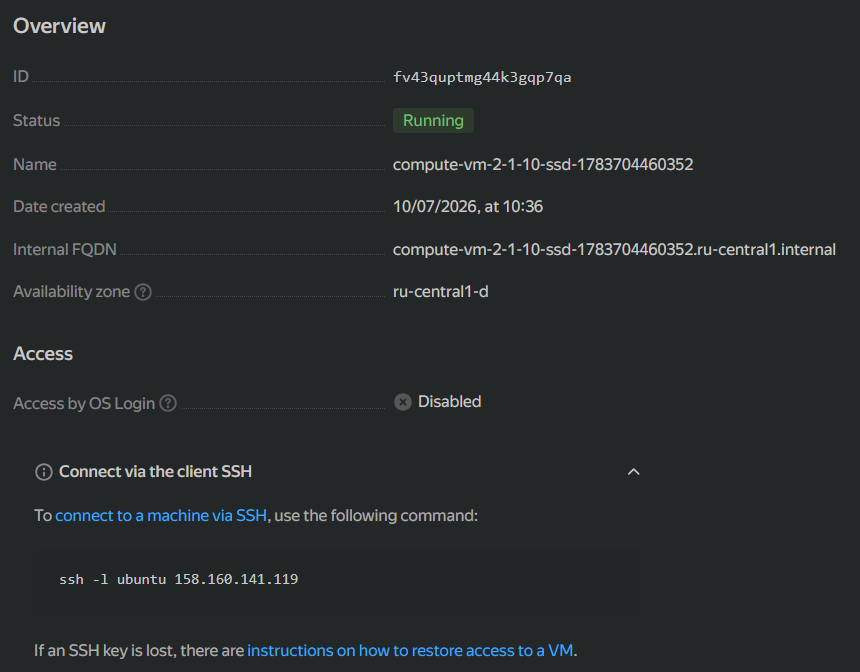

## Задание 1
### 5. Подключение к ВМ и проверка

```bash
ssh -i ~/.ssh/ssh-key-1783657996350 ubuntu@158.160.141.119
curl ifconfig.me
```
`158.160.141.119` - внешний IP совпал.

### Ответы на вопросы

**В чём суть исправленных ошибок?**
В `main.tf` опечатка: `platform_id = "standart-v4"` вместо `"standard-v4"`. Плюс `standard-v4` тоже нет в YC, используется `standard-v1`. Terraform validate не ловит такие ошибки - только apply показывает.

**Зачем `preemptible = true` и `core_fraction = 5`?**
`preemptible = true` - прерываемая ВМ (до 24ч), дешевле на ~60%.
`core_fraction = 5` - 5% ядра гарантировано, экономит деньги при низкой нагрузке.

Оба параметра снижают стоимость.

### Скриншот YC и curl ifconfig'а



```bash
ubuntu@compute-vm-2-1-10-ssd-1783704460352:~$ curl ifconfig.me
158.160.141.119
```

## Задание 2
Хардкод-значения `yandex_compute_image` и `yandex_compute_instance` заменены на переменные с префиксом `vm_web_` и типами. Значения по умолчанию сохранены прежними.

## Задание 3
Создан `vms_platform.tf` — туда перенесены переменные первой ВМ и добавлены переменные второй ВМ `vm_db_`. Создан ресурс `yandex_compute_instance.db` (name = "netology-develop-platform-db", cores = 2, memory = 2, core_fraction = 20, zone = "ru-central1-b") и соответствующая подсеть.

## Задание 4
В `outputs.tf` добавлен один output `vms_info`, содержащий instance_name, external_ip и fqdn для каждой ВМ.

```
terraform output
vms_info = {
  "db" = {
    "external_ip" = "103.76.55.254"
    "fqdn" = "epd2ohh0goepnv0akuri.auto.internal"
    "instance_name" = "netology-develop-platform-db"
  }
  "web" = {
    "external_ip" = "111.88.247.44"
    "fqdn" = "fhm7notiaekb2s7vour0.auto.internal"
    "instance_name" = "netology-develop-platform-web"
  }
}
```

## Задание 5
В `locals.tf` созданы локальные переменные для имён ВМ через интерполяцию:
```
locals {
  vm_web_name = "${var.project}-${var.vpc_name}-platform-${var.vm_web_role}"
  vm_db_name  = "${var.project}-${var.vpc_name}-platform-${var.vm_db_role}"
}
```

## Задание 6
Ввел map-переменные:
`vms_resources` — конфиги обеих ВМ (cores, memory, core_fraction, hdd_size, hdd_type)
`metadata` — общий блок metadata для всех ВМ

Неиспользуемые переменные закомментированы.

## Задание 7*
Команды `terraform console`:
1. `local.test_list[1]` → `"staging"`
2. `length(local.test_list)` → `3`
3. `local.test_map["admin"]` → `"John"`
4. `"${local.test_map["admin"]} is ${keys(local.test_map)[0]} for ${local.test_list[2]} server based on OS ${local.servers["production"].image} with ${local.servers["production"].cpu} vcpu, ${local.servers["production"].ram} ram and ${length(local.servers["production"].disks)} virtual disks"` → `"John is admin for production server based on OS ubuntu-20-04 with 10 vcpu, 40 ram and 4 virtual disks"`

## Задание 8*
Тип переменной `test`: `list(map(list(string)))`
Извлечение строки: `var.test[0]["dev1"][0]` → `"ssh -o 'StrictHostKeyChecking=no' ubuntu@62.84.124.117"`
