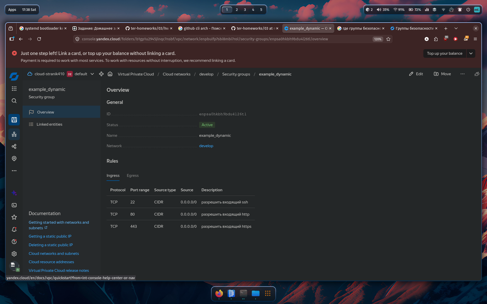

## Задание 1
1. Инициализировал проект (terraform init) через зеркало yandexcloud.
2. Применил конфигурацию (terraform apply). Создалось:
   - VPC сеть develop
   - Подсеть develop в ru-central1-a
   - Группа безопасности example_dynamic с правилами:
     - Входящие: SSH (22), HTTP (80), HTTPS (443) - отовсюду
     - Исходящие: весь TCP-трафик

Скриншот входящих правил группы безопасности в ЛК Yandex Cloud:



## Задание 2
**count-vm.tf** - две одинаковых ВМ web-1 и web-2 через count.
Имена сдвинуты на +1, чтобы не было web-0.

**for_each-vm.tf** - две ВМ main и replica с разными параметрами.
Переменная `each_vm` описана как `list(object(...))`, конвертируется в map через `{for vm in var.each_vm : vm.vm_name => vm}`.

ВМ из count-vm.tf создаются после ВМ из for_each-vm.tf (depends_on).

SSH-ключ читается через `file("~/.ssh/id_rsa.pub")` в local-переменной.

Обе ВМ назначена группа безопасности example_dynamic (security_group_ids).

## Задание 3
**disk_vm.tf:**
- 3 одинаковых диска по 1 ГБ через count.
- Одиночная ВМ storage (без count/for_each) с dynamic secondary_disk, который через for_each подключает все три диска.

## Задание 4
**ansible.tf** генерирует hosts.ini через templatefile из шаблона hosts.tftpl.
Шаблон динамический - обрабатывает любое количество ВМ в группах:
- webservers: web-1, web-2
- databases: main, replica
- storage: storage

Каждая ВМ содержит ansible_host (внешний IP) и fqdn (внутреннее доменное имя).

## Проблемы

1. Версия Terraform. В Arch репозитории был 1.15.7, а проект требовал ~>1.12.0.
   Фикс: сменил `required_version` на `>=1.12.0`.

2. Файл .terraformrc лежал в папке src, но Terraform читает конфиг из ~/.terraformrc.
   Фикс: скопировал файл в домашнюю директорию.

3. Чужие права на приватный ключ (0644 вместо 600). SSH отказывался подключаться.
   Фикс: `chmod 600 ~/.ssh/ssh-key-...`.

4. Не было файла ~/.ssh/id_rsa.pub - ключ назывался иначе.
   Фикс: создал симлинк `ln -sf ~/.ssh/ssh-key-....pub ~/.ssh/id_rsa.pub`.

5. Шаблон hosts.tftpl. Первая версия шаблона склеивала все строки в одну из-за
   неправильного расстановки ~ (trim) в директивах for/endfor.
   Фикс: убрал `~` с открывающего `%{` и расставил `~` только на закрывающем `%}`,
   чтобы сохранить переносы строк между группами и записями.

## Как удалить

```bash
terraform destroy
```
